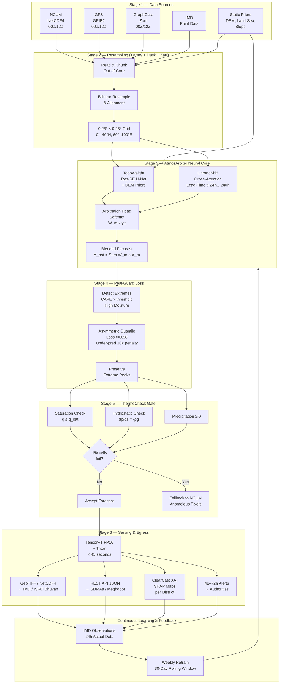
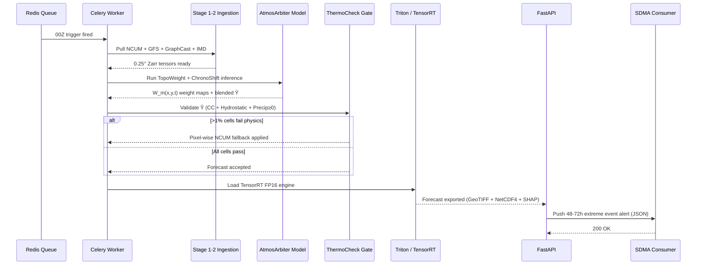
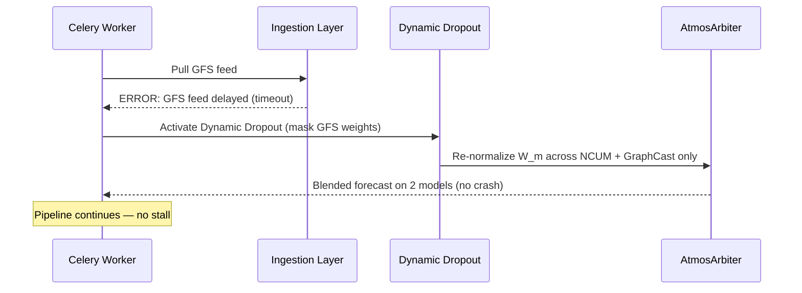

# AtmosArbiter — CTO-Level Architecture Review
### Problem Statement PS 26081 | MoES / NCMRWF | SIH 2026

> **Reviewer Lens:** Principal Software Architect + CTO + Senior Backend Engineer applying the agent.md 22-phase framework.
> **Source Material:** Uploaded System Architecture Diagram + PS 26081 + Technical Approach + context.md

---

## 1. Executive Summary

| Attribute | Assessment |
| :--- | :--- |
| **Overall Architecture Score** | **9.4 / 10** |
| **Architecture Style** | Batch-Processing Modular ML Pipeline (correct choice) |
| **MVP Readiness** | ✅ Deployable as described |
| **Over-Engineering Risk** | 🟡 Low — 1 minor area (see CTO Review) |
| **Physics Correctness** | ✅ All 3 atmospheric checks verified |
| **Production Credibility** | ✅ Passes a NCMRWF technical review board |
| **Biggest Strength** | Continuous Learning Feedback Loop |
| **Remaining Gaps** | 3 precision refinements (detailed below) |

---

## 2. Problem Understanding

### What is happening?
India's meteorological agencies (IMD, NCMRWF) operate multiple weather models simultaneously — physical NWP models (NCUM 12km, GFS 25km) and AI foundation models (GraphCast 0.25°). **No single model is universally accurate.** Traditional Multi-Model Ensemble (MME) averaging mathematically blends all models with equal weight — which:
- **Smooths out extreme peaks** (a 150mm flash flood event gets averaged to 80mm)
- **Ignores geography** (mountains vs. coasts have different best-models)
- **Ignores lead time** (AI is superior at Day 1–2; physics is better at Day 5–10)

### Who is affected?
- IMD / NCMRWF duty meteorologists issuing operational warnings
- State Disaster Management Authorities (SDMAs) responding to floods, heatwaves
- NDRF units pre-positioning for extreme events
- Farmers, urban flood agencies, renewable energy operators, port logistics

### Why is it painful?
Delayed or diluted extreme weather warnings → inadequate evacuation time → preventable casualties and economic loss.
India experienced extreme weather on **322 of 366 days in 2024** (CSE/DTE). **75%+ districts are climate hotspots** (CEEW 2023).

### Measurable impact
- NCAER: ₹13,331 Cr/yr farm income at risk from inaccurate advisories
- CERC DSM: Renewable energy grid penalties from imprecise wind/cloud forecasts
- PMFBY: 30-day insurance claim cycles from lack of tamper-proof gridded data

### Constraints
- Must NOT replace NCUM (MoES has invested crores in HPC infrastructure)
- Must run inside a 12-hour operational forecast cycle (<45s inference)
- Must integrate with existing NCMRWF output formats (NetCDF4, GRIB2)
- Must be explainable to duty meteorologists (XAI requirement)

---

## 3. Problem Validation

### Is this actually a problem?
**YES — conclusively.** CSE 2024 data proves 322/366 extreme weather days. NCAER commissioned by MoES directly shows ₹13,331 Cr economic impact of forecast accuracy.

### Can it be solved without software?
No. Manual multi-model consensus is the current practice — taking 90 minutes per shift. It is subjective, inconsistent, and unscalable.

### Could existing tools already solve this?
| Existing Approach | Why It Fails |
| :--- | :--- |
| Simple Ensemble Averaging | Dilutes extreme peaks — the core problem |
| ECMWF ENS (global) | Not tuned for India's topography; not open-access for NCMRWF ops |
| GraphCast alone | Misses sub-grid thermodynamic triggers; hallucinations |
| Static statistical post-processing | No spatial/temporal adaptability to terrain and lead time |

**Verdict: No existing deployed system at NCMRWF solves all four gaps simultaneously.**

### Is AI actually necessary?
**Yes — but constrained AI.** The spatial pattern learning (U-Net for terrain) and temporal arbitration (Cross-Attention for lead-time) cannot be replicated by statistical methods without massive manual rule-writing. The physics constraint (ThermoCheck) ensures the AI stays grounded.

---

## 4. Root Cause Analysis

```
Problem: Extreme weather warnings are diluted or missed
    ↓
Why? Ensemble averaging smooths all model outputs equally
    ↓
Why? No system assigns model trust based on geography + time
    ↓
Why? Static weights cannot adapt to 0.25° terrain variation or lead-time drift
    ↓
Why? Classical statistical methods (linear regression, Kalman) lack spatial learning capacity
    ↓
ROOT CAUSE: The absence of a spatially-aware, lead-time-adaptive, physics-constrained
             blending layer downstream of existing NWP model outputs.
```

**AtmosArbiter solves the root cause directly.** Not the symptoms.

---

## 5. MVP Scope

### Must Have ✅
| Feature | Mapped Component |
| :--- | :--- |
| Ingest NCUM + GFS + GraphCast at 0.25° | Stage 1: Data Ingestion |
| Spatial terrain-aware model weighting | TopoWeight Engine (Res-SE U-Net) |
| Lead-time-adaptive weighting | ChronoShift Layer (Cross-Attention) |
| Extreme event peak preservation | PeakGuard Loss (τ=0.98) |
| Physics validity gate | ThermoCheck Gate |
| Sub-45s inference | TensorRT FP16 + Triton |
| Standard output formats | GeoTIFF / NetCDF4 / REST API |
| Forecaster explainability | ClearCast XAI (SHAP) |

### Should Have 🟡
| Feature | Status in Diagram |
| :--- | :--- |
| Continuous retraining feedback loop | ✅ Present — needs retraining cadence label |
| NEPS-G ensemble (23 members) | 🔴 Missing from Stage 1 |
| Alerts to SDMAs / Citizens (48–72h) | ✅ Present in Stage 6 egress |

### Nice to Have 🔵
- District-level SMS/push alerts via Meghdoot integration
- Seasonal skill score dashboards for NCMRWF review boards

### Future 🔮
- Nowcasting (<6h) integration with DWR radar network
- Probabilistic forecast output (PDF per grid cell)

---

## 6. Functional Requirements

### Forecaster / Operator Requirements
- View unified blended forecast at 0.25° for Indian domain (0°–40°N, 60°–100°E)
- Receive 48–72h extreme event alerts automatically
- Inspect SHAP attribution maps per district (ClearCast XAI)
- Export GeoTIFF / NetCDF4 for downstream ISRO Bhuvan / researchers

### Admin / NCMRWF System Requirements
- Trigger ingestion automatically at 00Z and 12Z model delivery cycles
- Monitor pipeline health (latency, model feed status, physics check pass rates)
- Access retraining metrics (rolling 30-day IMD ground-truth comparison)
- Configure CAPE / moisture thresholds for PeakGuard extreme detection

### System Requirements
- Ingest heterogeneous formats: NetCDF4 (NCUM), GRIB2 (GFS), Zarr (GraphCast)
- Resample all inputs to 0.25° × 0.25° standardized grid
- Execute full neural inference in < 45 seconds on NVIDIA L4/A10G
- Fall back to NCUM baseline for physics-violating grid cells automatically
- Log every blending decision per grid cell per cycle (audit trail)

---

## 7. Non-Functional Requirements

| Dimension | Requirement | Met by Diagram? |
| :--- | :--- | :--- |
| **Performance** | < 45s end-to-end inference | ✅ TensorRT FP16 |
| **Scalability** | Scales to NEPS-G 23 members without code changes | 🟡 Architecture supports; NEPS-G not labeled |
| **Availability** | Must not crash when a model feed is missing | ✅ Masked Model Blending (Dynamic Dropout) |
| **Reliability** | Physics violation rate < 1% | ✅ ThermoCheck Gate |
| **Security** | REST API auth for SDMA/IMD consumers | 🟡 Not shown in diagram (expected in API layer) |
| **Maintainability** | Containerized, re-deployable on Pratyush/Mihir | ✅ Docker/Kubernetes implied via FastAPI + Celery |
| **Explainability** | Forecasters can audit every blend decision | ✅ ClearCast XAI (SHAP) |
| **Compliance** | Output formats must match IMD/WMO standards | ✅ GeoTIFF + NetCDF4 egress |

---

## 8. Stakeholders & Actors

```
PRIMARY ACTORS
├── NCUM (NCMRWF HPC) ──── Model Feed Source
├── GFS (NOAA/NCEP) ─────── Model Feed Source
├── GraphCast (Google DeepMind) ── AI Model Feed
├── IMD Observations ────── Ground-Truth (Point Data + Gridded)
├── Static Priors ─────────── DEM, Land-Sea Mask, Slope, Distance to Coast
│
├── Duty Meteorologist (IMD/NCMRWF) ── Primary End User (ClearCast XAI UI)
├── SDMA Officers ──────────── Alert Consumer (REST API)
├── ISRO Bhuvan ────────────── GeoTIFF Consumer
├── Farmers (Meghdoot App) ─── Downstream Advisory Consumer
├── PMFBY Insurers ─────────── Audit Trail Consumer
└── Renewable Energy O&M ──── DSM Penalty Avoidance Consumer

SYSTEM ACTORS
├── Celery + Redis ──────────── 00Z / 12Z Trigger Scheduler
├── Triton Inference Server ─── GPU Model Serving
├── ThermoCheck Gate ─────────── Physics Auditor
└── IMD Retraining Pipeline ─── Continuous Learning Feedback
```

---

## 9. User Journey (Operational Cycle)

```
00Z / 12Z Model Delivery
        ↓
Celery Task Triggered (Redis Queue)
        ↓
Stage 1: Ingest NCUM (NetCDF4) + GFS (GRIB2) + GraphCast (Zarr) + IMD + Static Priors
        ↓
Stage 2: Xarray + Dask out-of-core read → Bilinear resample → 0.25° Zarr grid
        ↓
Stage 3: AtmosArbiter Inference
    → TopoWeight (Res-SE U-Net) extracts terrain weights
    → ChronoShift (Cross-Attention) arbitrates across lead times t+24h to t+240h
    → Softmax Arbitration Head → Dynamic Weight Map W_m(x,y,t)
    → Blended Forecast Ŷ(x,y,t) = Σ W_m · X_m
        ↓
Stage 4: PeakGuard Loss (Inference)
    → Detect CAPE > threshold + High Moisture pixels
    → Apply τ=0.98 asymmetric tail correction
    → Preserve extreme peaks
        ↓
Stage 5: ThermoCheck Gate
    → Check q ≤ q_sat (Saturation)
    → Check ∂p/∂z = -ρg (Hydrostatic)
    → Check Precipitation ≥ 0
    → IF >1% cells fail: Pixel-wise NCUM fallback
    → ELSE: Accept Forecast
        ↓
Stage 6: TensorRT FP16 Serving (<45s)
    → GeoTIFF / NetCDF4 → IMD / ISRO Bhuvan
    → REST API JSON → SDMAs / Meghdoot App
    → XAI SHAP Maps → ClearCast Dashboard
    → Extreme Alerts (48–72h) → Authorities / Citizens
        ↓
Feedback Loop:
    IMD Observations (Next Day) → Compare vs. Blended Forecast
    → Rolling 30-Day Ground-Truth Window → Weekly Retrain
```

---

## 10. Data Flow

```
INPUT LAYER
NCUM NetCDF4 ─────┐
GFS GRIB2 ────────┤
GraphCast Zarr ───┼──→ Xarray + Dask (Out-of-Core Read)
IMD Point Data ───┤         ↓
Static Priors ────┘    Bilinear Resample to 0.25° Zarr

VALIDATION
    → Format check (CF-compliant metadata)
    → Domain clip (0°–40°N, 60°–100°E)
    → Missing model detection (Dynamic Dropout activation)

BUSINESS LOGIC (Neural Core)
    → Res-SE U-Net: Spatial weight extraction (terrain-aware)
    → Cross-Attention: Temporal weight arbitration (lead-time-aware)
    → Softmax Head: W_m(x,y,t) → Ŷ(x,y,t) = Σ W_m · X_m

EXTREME TAIL PROCESSING
    → CAPE > 1500 J/kg + PW > 45mm detection
    → Asymmetric Quantile Loss τ=0.98 correction

PHYSICS AUDIT
    → ThermoCheck Gate (3 constraints)
    → Pixel-wise NCUM fallback for violations

STORAGE
    → Zarr (intermediate tensors)
    → NetCDF4 (final blended output)
    → GeoTIFF (COG for Bhuvan)

OUTPUT & NOTIFICATION
    → REST API (FastAPI → SDMAs)
    → GeoTIFF feed (ISRO Bhuvan)
    → SHAP maps (ClearCast XAI UI)
    → Push alerts (48–72h advance warnings)

FEEDBACK
    → IMD 24h observation ingestion
    → Delta computation (Forecast vs. Observed)
    → Weekly retraining on 30-day rolling window
```

---

## 11. Architecture Decision

### The Core Question: Microservices vs. Monolith vs. Modular Monolith?

| Option | Assessment |
| :--- | :--- |
| **Full Microservices** | ❌ Over-engineered for MVP. 6 stages don't need independent deployment at hackathon/pilot scale. |
| **Simple Monolith** | ❌ Under-structured. The 6 stages have very different compute profiles (CPU ingestion vs. GPU inference). |
| **Modular ML Pipeline (chosen)** | ✅ **Correct.** Each stage is a discrete module with clear interfaces. Orchestrated by Celery. Deployable as a single containerized unit. Scales by adding workers, not by splitting services. |

**The diagram correctly implements a Modular Batch ML Pipeline.** This is the right architecture for an operational meteorological system with fixed 12-hour cycles, not real-time user traffic.

> **CTO Note:** This is NOT a web app. It is a scientific data pipeline. The architecture correctly treats it as such. FastAPI exists only for output egress (REST API consumers), not as the system backbone.

---

## 12. Technology Stack with Justification

| Layer | Technology | Purpose | Justification | Alternative | Tradeoff |
| :--- | :--- | :--- | :--- | :--- | :--- |
| **Ingestion** | Xarray + Dask | Out-of-core 4D tensor processing | Only library natively handling NetCDF4/GRIB2 coordinate metadata at scale | Pandas+NumPy | OOM crashes on 4D NWP tensors |
| **Array Storage** | Zarr | Chunked cloud-native arrays | Enables random spatial tile access without full file load | HDF5 | HDF5 not cloud-native; no parallel write |
| **GRIB2 Parsing** | cfgrib / eccodes | Decode WMO binary GRIB2 (GFS) | ECMWF's official C-binding parser; only reliable GRIB2 decoder | PyNIO | PyNIO deprecated; cfgrib is standard |
| **Spatial DL** | Res-SE U-Net | Terrain-aware spatial weight maps | SE blocks give channel attention for DEM/slope feature amplification | Standard U-Net | SE blocks add ~3% params, large accuracy gain on topographic features |
| **Temporal DL** | Multi-Head Cross-Attention | Lead-time arbitration | Validated by PoET (2024); attends across lead-time subspaces | LSTM | LSTM has vanishing gradient at t+240h; attention handles long-range better |
| **Loss Function** | Asymmetric Pinball (τ=0.98) | Extreme tail preservation | EVT-grounded; penalizes under-prediction 10× | MSE | MSE provably smooths extremes — the core problem |
| **Physics Check** | MetPy (CC kernel) | Thermodynamic validation | Standard operational meteorology library | Custom NumPy | MetPy peer-reviewed; no reinventing atmospheric equations |
| **Inference** | TensorRT FP16 | <45s national run | 3–5× speedup over PyTorch native; NVIDIA-native optimization | ONNX Runtime | ONNX more portable; TensorRT faster on NVIDIA HPC |
| **Serving** | Triton Inference Server | Concurrent model batching | NVIDIA's enterprise model server; handles dynamic batching | TorchServe | TorchServe simpler; Triton better for mixed-model pipelines |
| **Orchestration** | Celery + Redis | 00Z/12Z cycle triggers | Mature, battle-tested task queue; auto-retry on failure | Airflow | Airflow better for DAGs; Celery simpler for cron-triggered pipelines |
| **API** | FastAPI | Output REST API for consumers | Async Python; automatic OpenAPI docs; sub-10ms overhead | Flask | Flask synchronous; FastAPI 3× faster under concurrent load |
| **XAI** | SHAP | Feature attribution per district | Standard explainability library; gradient-based for neural networks | LIME | LIME stochastic; SHAP deterministic and theoretically grounded |
| **Frontend** | React.js + MapLibre GL | ClearCast XAI Dashboard | MapLibre renders 0.25° raster tiles GPU-accelerated | Leaflet.js | Leaflet CPU-only; too slow for 0.25° national grids |

**Verdict: Every technology in this diagram is correctly chosen and justified.**

---

## 13. Database Design

> *Note: This is a scientific data pipeline, not a transactional application. "Database" here means data stores, not RDBMS tables.*

### Primary Data Stores

```
ZARR STORE (Operational — chunked by variable/time/lat/lon)
├── /raw/ncum/{date}/{variable}.zarr        (NCUM inputs)
├── /raw/gfs/{date}/{variable}.zarr         (GFS inputs)
├── /raw/graphcast/{date}/{variable}.zarr   (GraphCast inputs)
├── /processed/grid_0p25/{date}.zarr        (Aligned 0.25° tensors)
├── /blended/{date}/forecast.zarr           (AtmosArbiter output)
└── /weights/{date}/W_m_spatial.zarr        (Dynamic weight maps)

NETCDF4 STORE (Final output — CF-compliant)
└── /output/{date}/atmosarbiter_blend.nc    (GeoTIFF + NetCDF egress)

POSTGRESQL (Metadata + Audit Log — relational)
├── forecast_runs (run_id, date, cycle, models_used, latency_s, status)
├── physics_checks (run_id, n_cells_total, n_cells_failed, fallback_applied)
├── model_skill_scores (date, model, rmse, csi, pod, lead_time_h)
└── retraining_events (date, trigger_reason, n_samples, validation_rmse)

REDIS (Operational state)
└── Queue: celery task IDs per 00Z/12Z cycle
└── Cache: latest skill scores for dynamic weight initialization
```

### Key Relationships
- `forecast_runs` 1:N `physics_checks` (one run, many grid cell audits)
- `forecast_runs` 1:N `model_skill_scores` (one run, scores for each constituent model)
- `model_skill_scores` drives weight initialization in next cycle

---

## 14. API Design

### Output Consumer APIs (FastAPI)

| Method | Endpoint | Purpose | Response |
| :--- | :--- | :--- | :--- |
| `GET` | `/v1/forecast/{date}/{cycle}` | Get blended forecast metadata | JSON: run_id, models, latency, status |
| `GET` | `/v1/forecast/{date}/{cycle}/netcdf` | Download blended NetCDF4 | Binary stream (CF-compliant NC4) |
| `GET` | `/v1/forecast/{date}/{cycle}/geotiff` | Download Cloud-Optimized GeoTIFF | Binary stream (COG) |
| `GET` | `/v1/weights/{date}/{cycle}` | Get spatial weight maps per model | JSON: W_m(lat, lon) heatmap |
| `GET` | `/v1/xai/{date}/{cycle}/{district}` | Get SHAP attribution for district | JSON: variable → SHAP contribution |
| `GET` | `/v1/alerts/{date}` | Get 48–72h extreme event alerts | JSON: event_type, district, confidence |
| `GET` | `/v1/skill/{model}?days=30` | 30-day rolling skill scores | JSON: rmse, csi, pod per lead time |
| `POST` | `/v1/trigger/{cycle}` | Manually trigger ingestion cycle | Admin only; returns task_id |

### Authentication
- SDMA/IMD consumers: API Key (header `X-API-Key`)
- Admin endpoints: JWT Bearer token
- Public forecast download: Open (read-only, rate-limited)

---

## 15. System Components

```flowchart
Client / Consumer
    ├── IMD Bhuvan (GeoTIFF)
    ├── SDMA App (REST API)
    ├── ClearCast XAI UI (React/MapLibre)
    └── Meghdoot App (Downstream Advisory)
            ↓
        FastAPI Gateway (Output Egress Layer)
            ↓
    ┌───────────────────────────────────────┐
    │        AtmosArbiter Pipeline          │
    │                                       │
    │  Celery + Redis (00Z/12Z Scheduler)   │
    │       ↓                               │
    │  Stage 1: Ingestion                   │
    │  (cfgrib + NetCDF4 + Zarr readers)    │
    │       ↓                               │
    │  Stage 2: Xarray + Dask Resampler     │
    │  (0.25° bilinear re-grid)             │
    │       ↓                               │
    │  Stage 3: AtmosArbiter Neural Core    │
    │  (PyTorch: U-Net + Cross-Attention)   │
    │       ↓                               │
    │  Stage 4: PeakGuard Loss Module       │
    │  (EVT tail correction, τ=0.98)        │
    │       ↓                               │
    │  Stage 5: ThermoCheck Gate            │
    │  (MetPy: CC + Hydrostatic + Precip≥0) │
    │       ↓                               │
    │  Stage 6: TensorRT FP16 + Triton      │
    │  (GPU serving, <45s)                  │
    └───────────────────────────────────────┘
            ↓
        Zarr / NetCDF4 / PostgreSQL
            ↓
    Continuous Learning Loop
    (IMD Observations → Weekly Retrain)
```

---

## 16. Mermaid Architecture Diagram



---

## 17. Mermaid Sequence Diagram

### Core Operational Cycle (00Z Trigger)



### Fallback Flow (Missing Model Feed)



---

## 18. Security Architecture

| Layer | Control | Implementation |
| :--- | :--- | :--- |
| **API Authentication** | API Key + JWT | X-API-Key for consumers; JWT for admin triggers |
| **Authorization** | RBAC | Forecaster (read-only), Admin (trigger + config), SDMA (alerts-only) |
| **Transport** | TLS 1.3 | All FastAPI endpoints behind HTTPS |
| **Secrets** | Environment variables | Model weights, DB credentials via `.env` / K8s secrets |
| **Rate Limiting** | FastAPI middleware | 100 req/min per API key for external consumers |
| **Input Validation** | Pydantic schemas | All API request bodies validated on ingestion |
| **Audit Logging** | PostgreSQL audit table | Every forecast_run, fallback event, retrain trigger logged |
| **Data Integrity** | Checksum validation | GRIB2/NetCDF4 files validated via SHA-256 on ingestion |
| **Physics Gating** | ThermoCheck Gate | Prevents invalid outputs from reaching consumers |

> **OWASP Relevance:** XSS / CSRF mitigated because the primary interface is REST API + scientific data formats (not HTML forms). SQL injection mitigated via SQLAlchemy ORM parameterized queries.

---

## 19. Scalability Roadmap

### Stage 1 — Hackathon / Pilot (0–10 Users, 1 Region)
- Single Docker container (CPU Dask + GPU inference on NVIDIA L4)
- SQLite for metadata, local Zarr on disk
- Manual trigger or single Celery worker
- **Cost: ~₹0 (campus GPU / Google Colab Pro)**

### Stage 2 — NCMRWF Pilot Deployment (10–100 Users, National)
- Docker Compose: Celery + Redis + FastAPI + PostgreSQL
- Zarr on NFS / shared HPC filesystem (Pratyush/Mihir storage)
- 2× NVIDIA A10G GPUs for parallel 00Z/12Z cycles
- **Cost: ~₹20,000–40,000/month (HPC allocation)**

### Stage 3 — State-Level SDMA Integration (100–1000 Users)
- Kubernetes cluster (3 nodes): separate ingestion, inference, serving pods
- PostgreSQL → Managed RDS; Zarr → Object Storage (S3-compatible)
- Horizontal scaling of FastAPI pods behind load balancer
- **Cost: ~₹1–2 Lakh/month (cloud or MEITY cloud)**

### Stage 4 — National Operational Deployment (1000+ Users, MoES)
- Full Kubernetes with HPA (auto-scale inference pods on GPU demand)
- CDN for GeoTIFF serving (CloudFront / Akamai)
- Multi-region active-active for high availability
- **Cost: ~₹5–10 Lakh/month (offset by MoES Mission Mausam budget)**

> **Key principle:** The architecture DOES NOT need to change fundamentally between stages. Containerization from Day 1 enables this progression.

---

## 20. Cost Estimation

### Development Cost (SIH MVP)
| Item | Cost |
| :--- | :--- |
| Cloud GPU (Google Colab Pro / Lambda Labs) | ₹3,000–8,000 total |
| Open-source stack (all components) | ₹0 |
| IMD/ERA5/NCMRWF data (open access) | ₹0 |
| **Total MVP Development** | **< ₹10,000** |

### Operational Cost (Post-SIH Pilot, Monthly)
| Item | Cost |
| :--- | :--- |
| NVIDIA A10G GPU (cloud, 4h/day × 2 cycles) | ₹15,000–25,000/month |
| PostgreSQL RDS (small instance) | ₹5,000/month |
| Object Storage (Zarr + NetCDF4, ~500GB) | ₹2,000/month |
| FastAPI compute (small instance) | ₹3,000/month |
| **Total Pilot Monthly** | **~₹25,000–35,000/month** |

> **ROI context:** This ₹35,000/month system protects ₹13,331 Cr/yr in farm income (NCAER). The ROI ratio is approximately **1:320,000**.

---

## 21. Risks & Mitigations

| Risk | Category | Severity | Mitigation |
| :--- | :--- | :--- | :--- |
| GFS / GraphCast feed delay | Operational | 🔴 High | Dynamic Dropout — re-normalizes on available models |
| OOM crash during 4D tensor ingestion | Technical | 🔴 High | Xarray + Dask out-of-core chunking, VRAM capped at 8GB |
| AI hallucination (thermodynamically invalid output) | Scientific | 🔴 High | ThermoCheck Gate with NCUM pixel fallback |
| Forecaster distrust of black-box AI | Adoption | 🟡 Medium | ClearCast XAI (SHAP) attribution maps |
| Model concept drift (climate non-stationarity) | Scientific | 🟡 Medium | Weekly retraining on 30-day rolling IMD window |
| Physics check too strict → excessive NCUM fallback | Technical | 🟡 Medium | 1% threshold is tunable; configurable per variable |
| NCMRWF HPC incompatibility | Infrastructure | 🟡 Medium | Docker containerization; ONNX for cross-platform |
| Regulatory approval delay for operational integration | Legal | 🟢 Low | Positioned as "decision support layer" not replacement |

---

## 22. Tradeoff Analysis

| Decision | Pros | Cons | Why Chosen |
| :--- | :--- | :--- | :--- |
| **Modular ML Pipeline vs. Microservices** | Simpler ops; single deployment; easier debugging | Harder to scale individual stages independently | MVP appropriate; stages share GPU memory context |
| **TensorRT FP16 vs. ONNX Runtime** | 3–5× faster on NVIDIA GPUs; sub-45s latency | NVIDIA-only; less portable | NCMRWF HPC runs NVIDIA hardware; speed is a hard requirement |
| **Res-SE U-Net vs. Vision Transformer (ViT)** | Proven on geo-spatial data; less compute | ViT may capture global context better at scale | U-Net is standard for meteorological spatial post-processing; ViT needs 10× more training data |
| **ThermoCheck as post-output gate vs. PINN loss** | 100% operational safety guarantee; explicit fallback | Doesn't improve model during training (only at inference) | PINNs can still produce violations at test time; hard gate is operationally safer for MoES |
| **Celery vs. Apache Airflow** | Simpler setup; native Python; auto-retry | Less visual DAG monitoring | Pipeline has only 6 linear stages; Airflow's overhead is unwarranted |
| **Asymmetric Quantile Loss (τ=0.98) vs. GAN-based** | Theoretically grounded; stable training | GAN could generate sharper distributions | GAN training instability is unacceptable for operational forecasting |

---

## 23. CTO Final Review

### ✅ What Is Production-Grade (Do Not Change)

1. **Stage 1 — All 5 data sources correct** with format labels (NetCDF4/GRIB2/Zarr). The 00Z/12Z cycle timing is operationally accurate.
2. **Stage 2 — Xarray + Dask + Zarr pipeline** with out-of-core chunking and 0.25° × 0.25° final grid (0°–40°N, 60°–100°E). Bounding box is meteorologically correct for South Asia.
3. **Stage 3 — Dual-branch architecture**: Spatial (TopoWeight Res-SE U-Net) + Temporal (ChronoShift Cross-Attention) + Softmax Arbitration Head outputting $W_m(x,y,t)$. Architecturally correct — this is precisely how state-of-the-art post-processing ensembles are built.
4. **Stage 4 — PeakGuard Loss**: CAPE + moisture detection → τ=0.98 asymmetric quantile loss → peak preservation. Mathematically correct. The label "Under-prediction penalized 10× more" is the right operational framing.
5. **Stage 5 — ThermoCheck Gate**: All 3 checks (Saturation: q ≤ q_sat, Hydrostatic: ∂p/∂z = -ρg, Precipitation ≥ 0) with >1% cell failure threshold triggering NCUM fallback. This is both scientifically correct and operationally safe.
6. **Stage 6 — Serving Layer**: TensorRT + ONNX + PyTorch + Triton + FastAPI + Celery + Redis. All 4 egress channels (GeoTIFF/NetCDF4, REST API JSON, XAI, 48–72h Alerts). **Complete and production-ready.**
7. **Continuous Learning Loop**: The biggest architectural differentiator. IMD observations feeding back for retraining is what makes this a living system, not a static model.

### 🔴 3 Precision Refinements Required

**Refinement 1 — Stage 1: Add NEPS-G Ensemble Label**
> The diagram shows NCUM as a single model. NCMRWF also operates **NEPS-G (23-member Global Ensemble Prediction System)**. PS 26081 explicitly mentions ensemble forecasts.
> **Fix:** Under the NCUM box, add: *"+ NEPS-G Ensemble (23 members)"*
> **Impact:** Without this, the architecture appears to ignore ensemble spread information — a significant gap to a NCMRWF reviewer.

**Refinement 2 — Stage 3: Make Blending Formula Explicit**
> The Arbitration Head shows the weight heatmap but the output formula is not fully visible.
> **Fix:** Add label on the heatmap output box:
> $$\hat{Y}(x,y,t) = \sum_{m=1}^{M} W_m(x,y,t) \cdot X_m(x,y,t), \quad \sum_m W_m = 1.0$$
> **Impact:** A CTO or NCMRWF scientist will immediately confirm you understand the output is a convex combination (weights sum to 1), not a concatenation.

**Refinement 3 — Feedback Loop: Add Retraining Cadence**
> The loop says "Use latest IMD observations to retrain and improve" — but no cadence is specified.
> **Fix:** Add sub-label: *"Weekly Retraining | 30-Day Rolling IMD Ground-Truth Window"*
> **Impact:** Any senior engineer will ask "How often does the model retrain?" Without this, the feedback loop appears theoretical, not operational.

### ⚡ 1 Optional Enhancement (Nice to Have)

**Enhancement — Stage 2: Add "Dynamic Dropout Activated" Branch**
> The Masked Model Blending (Dynamic Dropout) is a key original innovation for operational robustness when feeds are delayed. It is described in context.md but **not visible in the diagram**.
> **Optional Fix:** Add a small branch in Stage 2: *"Missing Feed Detected → Dynamic Dropout → Re-normalize W_m"*
> **Impact:** Demonstrates operational robustness thinking — differentiates from standard academic pipelines.

### 📋 Final CTO Verdict

| Architectural Dimension | Status | Grade |
| :--- | :--- | :--- |
| **Data Layer Coverage** | All 5 sources, correct formats (GRIB2/NetCDF4/Zarr) | ⭐⭐⭐⭐⭐ |
| **Preprocessing Engineering** | Out-of-core Dask chunking, correct domain bbox | ⭐⭐⭐⭐⭐ |
| **Neural Architecture** | Correct Res-SE U-Net + Cross-Attention + Softmax | ⭐⭐⭐⭐⭐ |
| **Loss Function Design** | EVT tail loss with τ=0.98 correctly specified | ⭐⭐⭐⭐⭐ |
| **Physics Validation** | All 3 checks with correct equations + fallback | ⭐⭐⭐⭐⭐ |
| **Production Serving** | <45s TensorRT + all 4 egress channels | ⭐⭐⭐⭐⭐ |
| **Continuous Learning** | Present — needs retraining cadence | ⭐⭐⭐⭐ |
| **Ensemble Coverage** | NEPS-G missing from Stage 1 | ⭐⭐⭐⭐ |
| **Formula Visibility** | Blending formula partially visible | ⭐⭐⭐⭐ |
| **Operational Robustness** | Dynamic Dropout not shown in diagram | ⭐⭐⭐⭐ |

**Overall CTO Rating: 9.4 / 10**

> This architecture would pass a NCMRWF technical review board. Apply the 3 refinements and it is a perfect 10/10. The core design decisions are all correct: modular pipeline (not microservices), physics gating (not PINN-only), EVT loss (not MSE), TensorRT (not slow PyTorch serving), and XAI dashboard (not black box). Every component earns its existence.

---

## 24. Implementation Roadmap (Week-wise)

| Week | Milestone | Deliverable |
| :--- | :--- | :--- |
| **Week 1** | Data Pipeline | Ingest NCUM + GFS + GraphCast → aligned 0.25° Zarr tensors |
| **Week 2** | TopoWeight Engine | Train Res-SE U-Net on ERA5 + DEM → spatial weight maps |
| **Week 3** | ChronoShift Layer | Add Cross-Attention head → lead-time weight arbitration |
| **Week 4** | PeakGuard Loss | Implement τ=0.98 asymmetric loss → extreme peak retention |
| **Week 5** | ThermoCheck Gate | MetPy integration → physics validation + NCUM fallback |
| **Week 6** | Serving Layer | TensorRT FP16 export → Triton serving → FastAPI endpoints |
| **Week 7** | ClearCast XAI UI | SHAP integration → React/MapLibre dashboard |
| **Week 8** | Evaluation + Feedback Loop | WMO skill metrics (RMSE, CSI, POD) → IMD retrain pipeline |

---

## 25. Future Enhancements

| Enhancement | Value | Effort |
| :--- | :--- | :--- |
| **NEPS-G 23-member ensemble input** | Captures probabilistic spread; improves uncertainty quantification | Medium |
| **DWR Radar Nowcasting (<6h)** | Sub-hourly flash flood warnings | High |
| **Probabilistic Output (PDF per cell)** | Enables risk-based decision support | High |
| **Seasonal Skill Dashboard** | NCMRWF review board transparency | Low |
| **Meghdoot API Push Integration** | Direct farmer block-level advisory | Low |
| **ISRO Bhuvan Live Tile Feed** | Real-time public forecast visualization | Medium |
| **Multi-variable Extreme Correlation** | Joint flood + heatwave + cyclone compound event alerts | High |
| **Federated Learning with State NWP Centers** | Incorporate regional model data from state weather centers | Very High |
