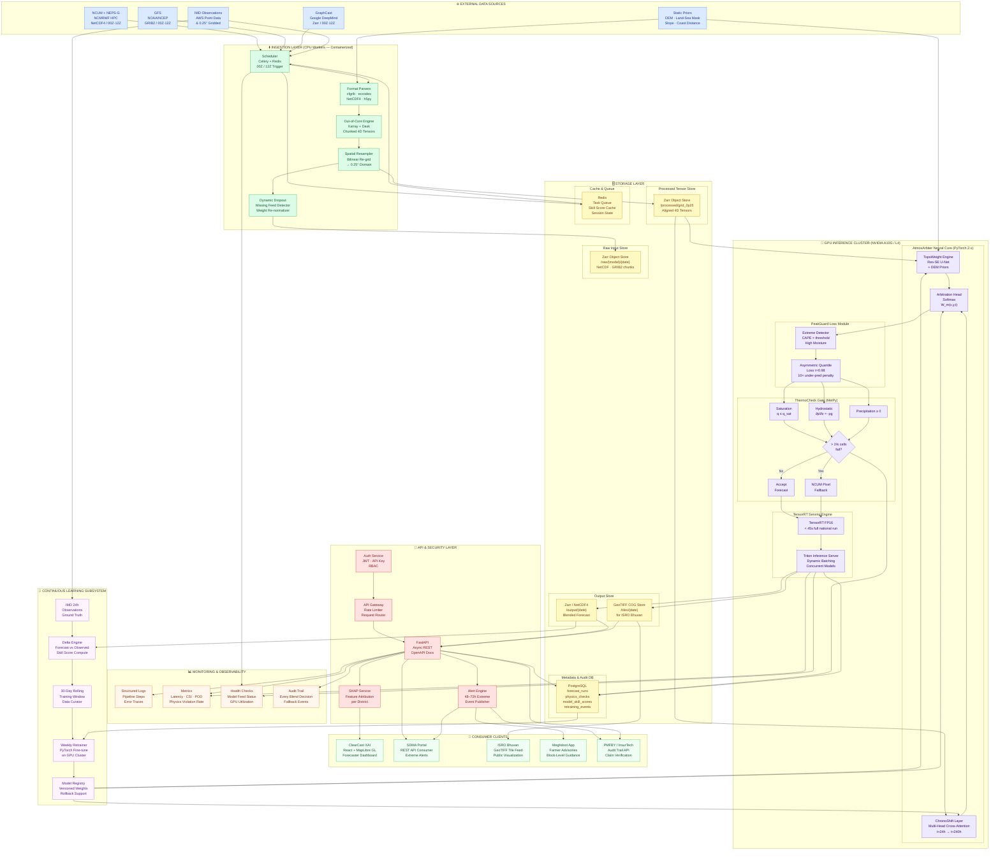

# AtmosArbiter — Full System Architecture Diagram
### PS 26081 | MoES / NCMRWF | SIH 2026

> This is the **System Architecture** — shows all layers, storage, compute, APIs, security, monitoring, and consumers.
> It is **distinct from the pipeline workflow** which only shows Stage 1 → 6 data flow.

---

## System Architecture (Mermaid — Copy into mermaid.live)

---

## Architecture Layers Explained

### Layer 1 — External Data Sources (Blue)
All 5 input feeds with correct formats. NCUM + NEPS-G (23-member) in same box.

### Layer 2 — Ingestion Layer (Green)
CPU-bound workers. Celery schedules at 00Z/12Z. Dynamic Dropout handles missing feeds. All out-of-core via Xarray + Dask.

### Layer 3 — Storage Layer (Yellow) ← **THE MISSING PIECE**
| Store | What It Holds |
| :--- | :--- |
| **Zarr Raw** | Raw NetCDF4/GRIB2 chunks per model per date |
| **Zarr Processed** | Aligned 0.25° 4D tensors ready for GPU |
| **Zarr/NetCDF4 Output** | Final blended forecast per cycle |
| **GeoTIFF COG Store** | Cloud-Optimized GeoTIFFs for ISRO Bhuvan tiles |
| **PostgreSQL** | forecast_runs, physics_checks, model_skill_scores, retraining_events |
| **Redis** | Task queue + skill score cache + session state |

### Layer 4 — GPU Inference Cluster (Purple)
AtmosArbiter neural core + PeakGuard + ThermoCheck + TensorRT/Triton. All GPU-bound.

### Layer 5 — API & Security Layer (Red)
JWT/API Key auth → API Gateway → FastAPI. SHAP service + Alert engine as separate services.

### Layer 6 — Monitoring (Orange)
Structured logs, latency/CSI/POD metrics, GPU health, full audit trail.

### Layer 7 — Consumer Clients (Light Green)
5 distinct clients with different data contracts (REST/GeoTIFF/XAI).

### Layer 8 — Continuous Learning Subsystem (Purple)
IMD observations → Delta computation → 30-day rolling window → Weekly GPU retrain → Model Registry with rollback.

---

## Key Differences vs. Workflow Diagram

| Workflow Diagram | System Architecture Diagram |
| :--- | :--- |
| Shows Stage 1 → 2 → 3 → 4 → 5 → 6 (data flow only) | Shows all 8 system layers with their infrastructure |
| No storage shown | 5 distinct storage systems (Zarr ×3, PostgreSQL, Redis) |
| No database | PostgreSQL with 4 tables for audit + skill tracking |
| No API Gateway or Auth | JWT + RBAC + Rate Limiter + Gateway |
| No monitoring | Logs, Metrics, Health, Audit Trail |
| No client separation | 5 distinct consumer clients with different contracts |
| No model versioning | Model Registry with rollback support |
| Single Celery mention | Ingestion layer with Scheduler, Parser, Dask, Resampler, Mask |
| No Dynamic Dropout visible | Explicit Dynamic Dropout node in Ingestion Layer |
| Feedback loop vague | Full Continuous Learning Subsystem with Delta Engine + Window Curator |
